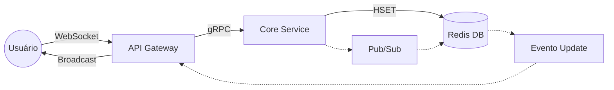

# 🌍 Art Pixel - Sistema Distribuído de Arte Colaborativa

> Plataforma de pintura em tempo real sobre mapas geográficos utilizando arquitetura de microsserviços, gRPC e WebSockets.
* **🔗 Demo Online:** [art-pixel.ddns.net](https://art-pixel.ddns.net/)


## 📖 Sobre o Projeto

O **Art Pixel** é uma aplicação distribuída onde múltiplos usuários podem colaborar (ou competir) pintando pixels em um mapa mundi compartilhado. Diferente de um canvas em branco tradicional (como o *r/place*), aqui a pintura ocorre sobre coordenadas geográficas reais, permitindo a "conquista de territórios" (bairros, cidades, países).

Este projeto foi desenvolvido como **Trabalho de Conclusão da disciplina de Sistemas Distribuídos**. O objetivo principal foi implementar na prática os conceitos de:
*   Comunicação remota (RPC/gRPC).
*   Sincronização de estado em tempo real.
*   Concorrência e consistência de dados.
*   Arquitetura orientada a microsserviços.

---

### Definição do serviço gRPC (Protocol Buffers)
Início da aplicação. O fluxo baseia-se no arquivo canvas.proto, que define o contrato de dados e serviços.

* canvas_pb2.py (Dicionário de Dados):
    * Função: Cuida da Serialização. Transforma objetos Python em binário extremamente compacto.

* canvas_pb2_grpc.py (Infraestrutura de Rede):
    * Stub (Cliente): Utilizado pelo Gateway para chamar funções remotas no Core como se fossem locais, gerenciando o túnel HTTP/2.
    * Servicer (Servidor): Utilizado pelo Core como uma base pronta que "escuta" as requisições, restando apenas a implementação da lógica de negócio (escrita no Redis).

---

## 🏗️ Arquitetura do Projeto

O sistema foi desenhado para ser desacoplado e escalável. O fluxo de dados segue um padrão unidirecional para escrita e *broadcast* para leitura.



## 🛠️ Ferramentas e Tecnologias
#### 1. Comunicação e Protocolos
* gRPC (Protobuf): Utilizado para comunicação interna entre Gateway e Core. Garante baixa latência e tipagem estrita.
* WebSockets: Mantém um canal aberto entre Frontend e Gateway para atualizações em tempo real (push).
* Redis Pub/Sub: Atua como Message Broker, desacoplando quem salva (Core) de quem notifica (Gateway).
#### 2. Backend
* Python (FastAPI): No API Gateway, gerenciando conexões assíncronas.
* Python (gRPC Server): No Core Service, contendo a lógica de negócios e acesso a dados.
#### 3. Frontend
* React + Vite: Interface do usuário.
* Leaflet (React-Leaflet): Renderização do mapa base (CartoDB Light).
* HTML5 Canvas: Camada de renderização gráfica otimizada sobreposta ao mapa.
#### 4. Infraestrutura
* Docker & Docker Compose: Orquestração de todo o ambiente (4 containers) com rede interna isolada.

---

## 📂 Estrutura de Pastas
```
/Art-Pixel
│
├── docker-compose.yaml       
├── README.md                 
│
├── proto/                   # Contrato de Interface
│   └── canvas.proto          
│
├── core-service/            # Microsserviço de Lógica
│   ├── Dockerfile
│   ├── main.py               
│   └── generated/           
│
├── gateway/                 # Microsserviço de Borda
│   ├── Dockerfile
│   ├── main.py               
│   └── generated/           
│
└── frontend/                # Cliente Web
│   ├── Dockerfile
│   ├── src/
│   │   └── App.jsx           
│   ├── components/      
│   └── vite.config.js
```

---

## 🚀 Como Rodar
Pré-requisitos: Ter o Docker e o Docker Compose instalados.
#### Clone o repositório:
```
git clone [https://github.com/thiago9852/pixel-art.git](https://github.com/thiago9852/pixel-art.git)
cd pixel-art
```

#### Suba o ambiente:
```
docker-compose up --build
```

#### Acesse a aplicação:
Abra seu navegador e vá para:
```
http://localhost:5173
```

---

## 🕹️ Funcionalidades
* **Pintura Geográfica:** Pixels atrelados a Latitude/Longitude.
* **Multiplayer Real-Time:** Visualização instantânea das ações de outros usuários.
* **Navegação RTS:**
  * Botão Direito: Arrastar mapa (Pan).
  * Scroll: Zoom In/Out.
* **Cursor de Precisão (Ghost Pixel):** Mostra exatamente onde o pixel será encaixado na grade antes do clique ("Snap to Grid").
* **Ferramentas:** Paleta de 16 cores e Borracha.
* **Telemetry:** Contador de usuários online em tempo real.

---


## 👨‍💻 Autor
Projeto desenvolvido por [Thiago Dias Ferreira].
* GitHub: [https://github.com/thiago9852]
* LinkedIn: [https://www.linkedin.com/in/thiago-ferreira-54491a278/]


